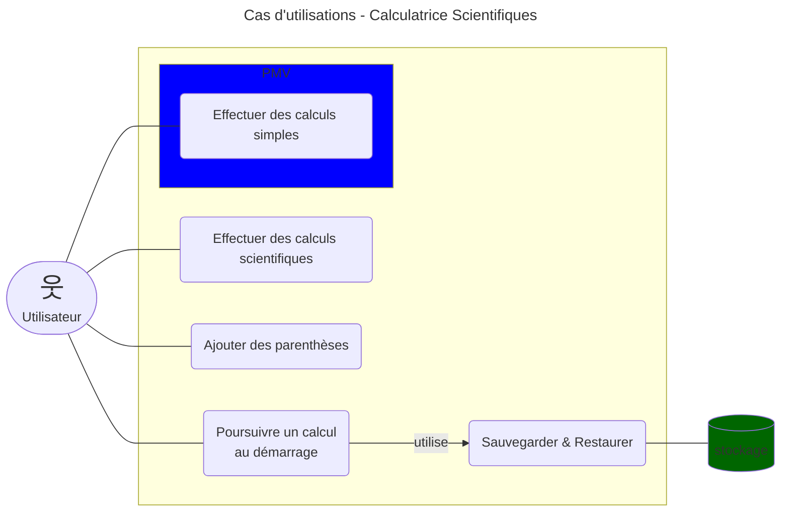
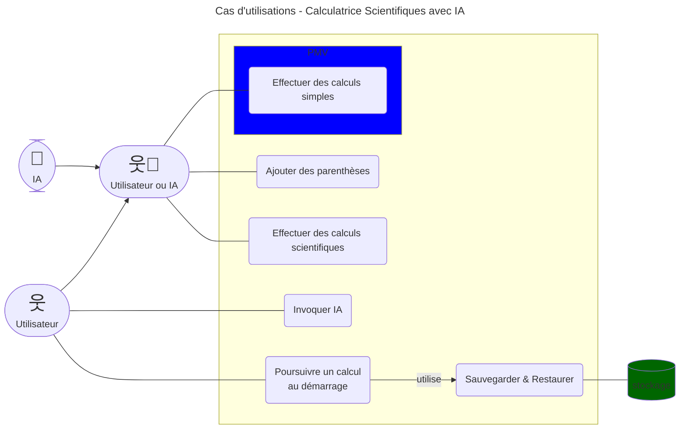
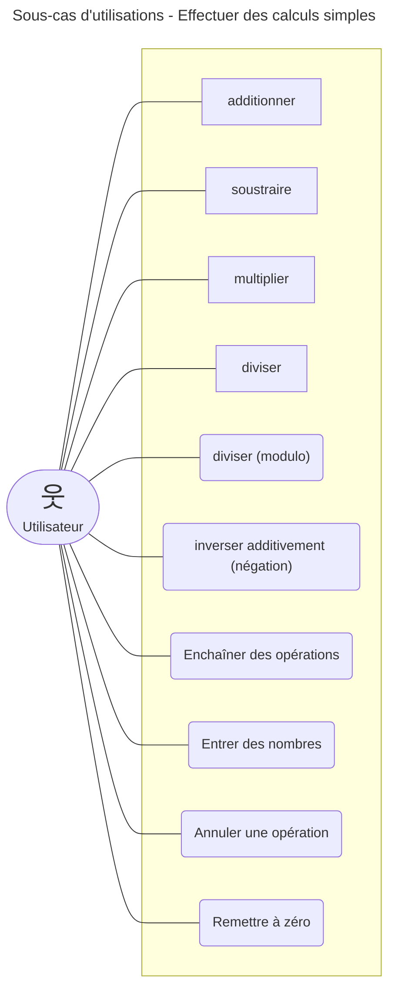

# Cas d'utilisation (Calculatrice Scientifique)

> Le meilleur logiciel pour les cas d'utilisation est [PlantUML](https://plantuml.com/fr/use-case-diagram).
> Toutefois, dans le but de simplifier les choses, nous allons
> nous rabattre sur une alternative moins puissante, mais plus simple appelée 
> [Mermaid](https://mermaid.js.org/syntax/flowchart.html).

> Les aventages de Mermaid sur PlanUML sont:
> * Simplicité
> * Affichage natif dans GitHub et PyCharm
>> Pour afficher dans PyCharm, il faut installer le plugin.
>> Une icone apparaît dans la gouttière quand on crée un diagramme.
>> Il suffit de cliquer dessus.

> Puisque Mermaid ne définit pas de diagrammes de cas d'utilisation natif,
> on va utiliser un diagramme de type [FlowChart](https://mermaid.js.org/syntax/flowchart.html) à la place.

> Le diagramme doit définir les acteurs du système et les différentes
> fonctionnalités accessibles à ces acteurs.

> Les fonctionnalités définies dans le document "fonctionnalités" devraient se retrouver 
> dans ce diagramme. Il peut y avoir plus de trucs.

> De plus, vous devez définir la portée du PMV (produit minimalement viable).

> Supposons qu'une IA peut elle-même effectuer des calculs...
> bien que ce soit un peu exagérer ici.

> Explorer un sous-cas d'utilisation:
>> Utile prioritairement pour les cas complexes qui font partie du PMV.

---

Retour au [README](../README.md).
