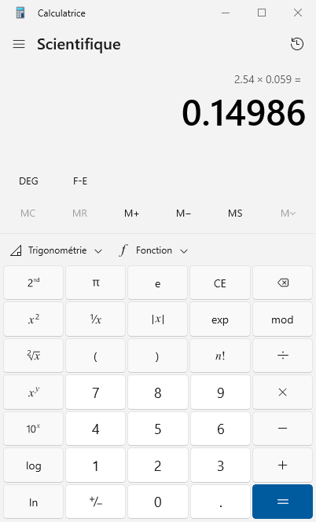

# Charte du projet Calculatrice Scientifique

Cette application permet de reproduire sur appareil mobile une calculatrice scientifique.
Une telle calculatrice permet d'aller au-delà des opérations d'une simple calculatrice de base 
comme l'addition, la soustraction, la multiplication et la division. 
On y retrouve par exemple l'exponentiation, les racines, les logarithmes,
l'inversion, etc.

> Ajoutez un paragraphe (ou plusieurs au besoin) qui décrit sommairement l'application que vous vous proposer de développer.
> L'idée est de faire comprendre à votre maman (ou votre papa) ce que vous voulez faire.

> Ajoutez une ou plusieurs images qui aide à comprendre ce que vous
> voulez faire.
>  - Application existante
>  - Croquis ou dessin personnel

> Idéalement, il faut ajouter vos images dans le projet lui-même,
> à moins d'utiliser un hyperlien vers une image externe et 
> disponible en permanence, libre de droit.

## Utilisateurs ciblés

- Possesseur d'un appareil mobile qui désire effectuer des calculs scientifiques.
  - Par exemple un étudiant en science au cégep.

> Précisez le public cible ou le ou les clients potentiels de votre application.
> Soyez précis.

## Applications existantes ou ressemblantes

- [Calculatrice Windows](https://apps.microsoft.com/detail/9WZDNCRFHVN5?hl=fr-ca&gl=CA)
- [Calculatrice Android](https://play.google.com/store/apps/details?id=com.google.android.calculator&hl=fr_CA&gl=US&pli=1)

> Il existe probablement déjà une application qui permet de faire
> ce que vous voulez faire, mais peut-être pas exactement comme vous voudriez
> le faire. 

> Ajoutez un ou plusieurs exemples avec un lien vers la page web de l'app.

## Spécificités

- Skins
  - Les interfaces des app existantes sont moches. 
  - On veut rendre ça cool!
- Partage d'un calcul
  - Possibilité de partager facilement notre démarche avec d'autres pour leur montrer comment on arrive à un résultat.
- Fonctions scientifiques avancées
  - La calculatrice de base d'Android est plutôt limitée de ce côté.

> Expliquez comment votre app se distingue des applications existantes
> répertoriées ci-dessus. Qu'est-ce qu'elle peut faire que les autres ne 
> font pas déjà? Nouvelle plate-forme? Gratuite? Etc.

## Disciplines scientifiques

- Mathématiques
  - La calculatrice permet d'effectuer de nombreux calculs mathématiques. 

> Outre l'informatique, indiquez la ou les disciplines scientifiques
> mises à contribution dans votre projet. Justifiez pourquoi.

## Nouveautés scientifiques et informatiques

### 1. Calculs mathématiques dans le domaine de l'informatique.

Il y a une différence entre les math pures et les math réalisées
par informatique, mais nous n'avons pas appris cela dans nos cours
(à part un peu en math discrètes).
Réaliser cette app nous permettra de comprendre comment ça marche.
On pourrait même implémenter nos propres algos de calculs.

### 2. Interface complexe

Pour le moment, tout ce qu'on a fait dans nos cours d'info était
des petites interfaces faciles. Là ce sera sensiblement plus compliqué.

> Indiquez comment la réalisation de votre application vous amène à aller
> au-delà ce que vous avez appris dans vos cours jusqu'ici, tant
> en informatique que dans la ou les disciplines scientifiques concernées
> par votre projet.

## Mentor

- Aucun

> Précisez le nom du mentor le cas échéant. 
> - Nom complet et fonction (p. ex. prof de math), ± coordonnées (si pas un.e prof du cégep).

## Technologies

- Python
- [Kivy](https://kivy.org/) ?
  - Pour réaliser l'interface. 

> Quelles technologies (langages, frameworks) envisagez-vous utiliser pour
> réaliser le projet? 
> Si vous ne savez pas, écrivez-le (p. ex. "Je ne sais pas" ou ???) 
> Si vous avez déjà des idées, précisez-les.
> Il ne s'agit pas d'un contrat de mariage, vous pouvez changer d'idée plus tard.
> Ajoutez un lien vers la page web du framework s'il s'agit d'une nouveauté
> non vue jusqu'ici dans le cours.
> Indiquez pourquoi cette technologie est pertinente pour votre projet.

## Risques et défis

### 1. Manquer de temps pour tout faire.
Il y a beaucoup de fonctionnalités et il est plus que possible
que le temps finisse par manquer pour tout faire.

### 2. Utilisation de la mauvaise technologie.
Pour le moment, nous pensons utiliser Kivy pour réaliser l'interface, 
mais nous ne connaissons pas encore vraiment cette technologie, et il se pourrait
qu'elle s'avère infructueuse.

> Identifiez les principaux risques et défis associés à votre
> projet. Expliquez pourquoi dans chaque cas.

---

Retour au [README](../README.md).