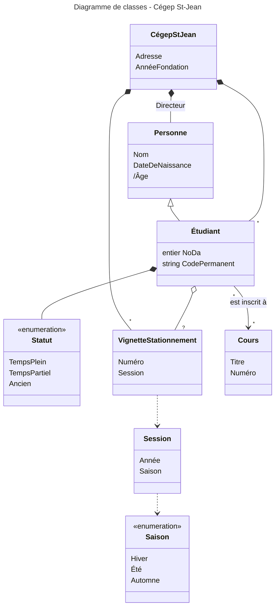
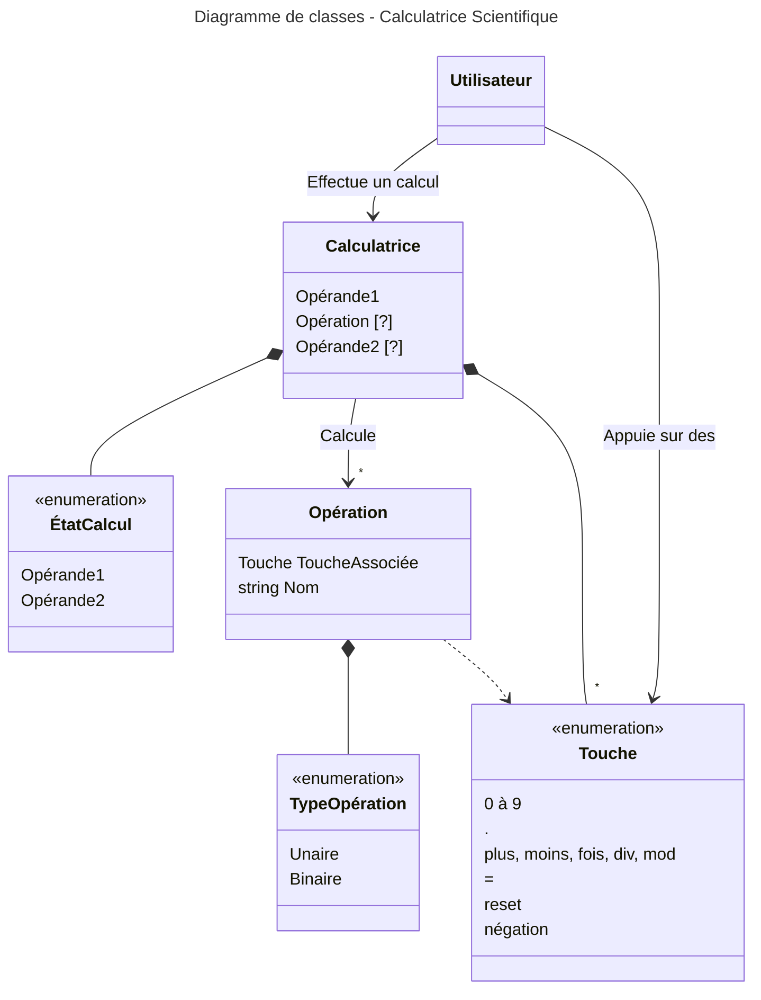
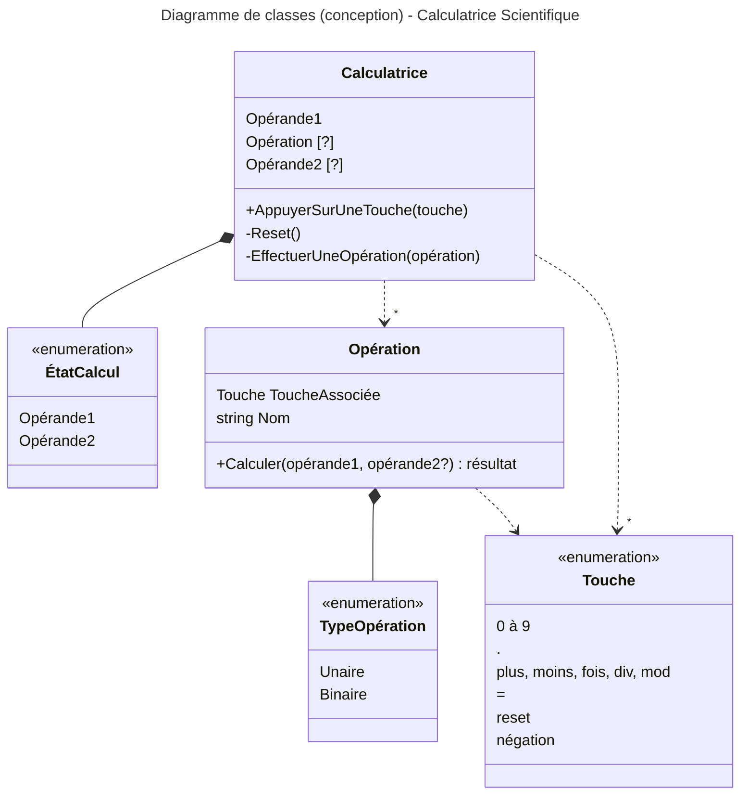

# Classes (Calculatrice Scientifique)

> Nous allons utiliser [Mermaid](https://mermaid.js.org/syntax/classDiagram.html) pour réaliser notre diagramme de classes.

> L'objectif est prinicipalement de modéliser les données traitées par votre application.
> > Les données du PMV ou plus.

> Dans un premier temps, nous allons modéliser un diagramme présent dans les notes de cours

---

> Voyons maintenant pour la calculatrice, mode PMV

---

> Si vous voulez aller plus loin, vous pouvez ajouter des méthodes dans vos classes
> Conventionnellement, on quitte alors le domaine de l'analyse pour entrer dans la conception.

> En mode conception, on supprime en générale les classes qui
> n'auront pas d'implémentation, comme Utilisateur dans notre cas.

> En mode conception, on élimine aussi les liens flous nommés pour les
> remplacer par des liens programmatiquement plus clairs.

---

Retour au [README](../README.md).
